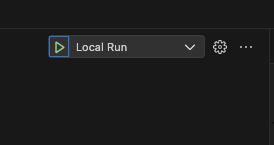
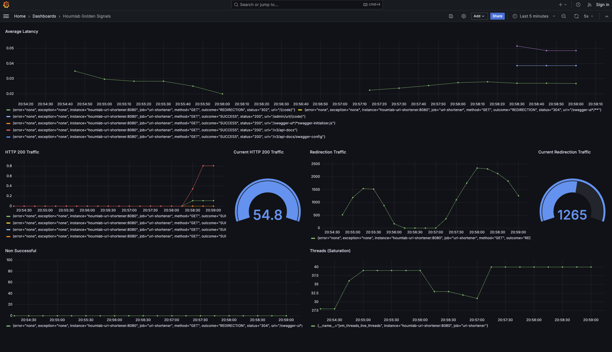

# Houmlab URL Shortener

Didáctico y selfhosted acortador de urls escrito en Java / Spring MVC. Es un ejercicio que sirve para demostrar algunos conceptos base de desarrollo: 

### Dev Containers

Este proyecto puede ser levantado fácilmente usando la definición de [Dev Containers](https://containers.dev/). 


### Golden Signals

Considerados los indicadores más importantes de la salud de un servicio: 


- **Latencia**: El tiempo que tarda en atenderse una solicitud. Es importante distinguir entre la latencia de las solicitudes exitosas y la latencia de las solicitudes fallidas.

- **Tráfico**: La demanda que se está colocando en tu sistema, a menudo medida en solicitudes por segundo.

- **Errores**: La tasa de solicitudes fallidas. Esto podría deberse al sistema (por ejemplo, un Error interno del servidor 500), al cliente (por ejemplo, una Solicitud incorrecta 400), o podría ser un error explícito (por ejemplo, "No se pudo conectar a la base de datos").

- **Saturación**: Qué tan "lleno" está tu servicio. Una medida de la utilización del sistema. Si el sistema está al 100% de utilización, está saturado.


https://sre.google/sre-book/monitoring-distributed-systems/#xref_monitoring_golden-signals

Este proyecto incluye toda la configuración necesaria para exportar sus métricas de uso a un servidor de Prometheus. Métricas que luego son consumidas por Grafana.

### OpenAPI

OpenAPI es una especificación que permite describir las capacidades de un servicio de manera estándar. Se incluyen algunas anotaciones para demostrar el uso de esta spec.

### Docker Compose

Se incluye un stack que se crea al momento de levantar el proyecto con Dev Containers. Este stack contiene todo lo necesario para el desarrollo y uso de este servicio a nivel local; MongoDB, Redis, Grafana y Prometheus.

# Uso 

Se incluye la definición de Dev Containers que levanta el entorno de desarrollo, MongoDB para el storage, Redis para la caché, Grafana y Prometheus para visualizar estadísticas si se quisiera. 

### Software necesario en la máquina local con Dev Containers

- [Docker ](https://www.docker.com/products/docker-desktop/)

- [Visual Studio Code (se recomienda porque es seamless con Dev Containers)](https://code.visualstudio.com/)

- [Extensión de Dev Containers para VSCode](https://marketplace.visualstudio.com/items?itemName=ms-vscode-remote.remote-containers)


Luego de instalar estos components la máquina local. Sólo basta abrir el directorio del proyecto. VSCode detectará automáticamente la presencia del directorio .devcontainer y sugerirá abrir el repositorio y la infra en un contenedor independiente. **Se incluye un archivo launch.json que dice a VScode cómo iniciar la app, ya con los parámetros locales listos para el bootstrap de Spring** :




Sólo basta con llamar a las distintas operaciones de la API definidas en el SwaggerUI.

## Endpoints 

### Definición de OpenAPI (Swagger UI)

Contiene la definición de la API con sus operaciones en una instancia de SwaggerUI.

http://localhost:8080/swagger-ui/index.html 


### Métricas


#### Prometheus Exporter

Las métricas se exportan en el siguiente endpoint:


http://localhost:8080/actuator/prometheus

Métricas actualmente exportadas:

```
management.endpoints.web.exposure.include=health,info,prometheus
management.metrics.export.prometheus.enabled=true
management.metrics.enable.spring.mvc=true
management.metrics.web.server.auto-time-requests=true
management.metrics.enable.logback=true
```

La configuración anterior permite obtener métricas como tiempos de respuesta, accesos y código de respuestas, cantidad de ERROR logs. Además de todas las métricas de la máquina CPU, memoria, etc. 

#### Prometheus Server

http://localhost:9090/


#### Grafana Server UI

http://localhost:3000/

#### Dashboard de Golden Signals

Se incluye como parte de este proyecto un diagrama que puede ser enriquecido y enfocado a necesidades específicas. Sólo se debe descargar [el archivo que se incluye en este repositorio](/telemetry/houmlab-golden-signals-dashboard.json) e importar dentro de grafana. 

